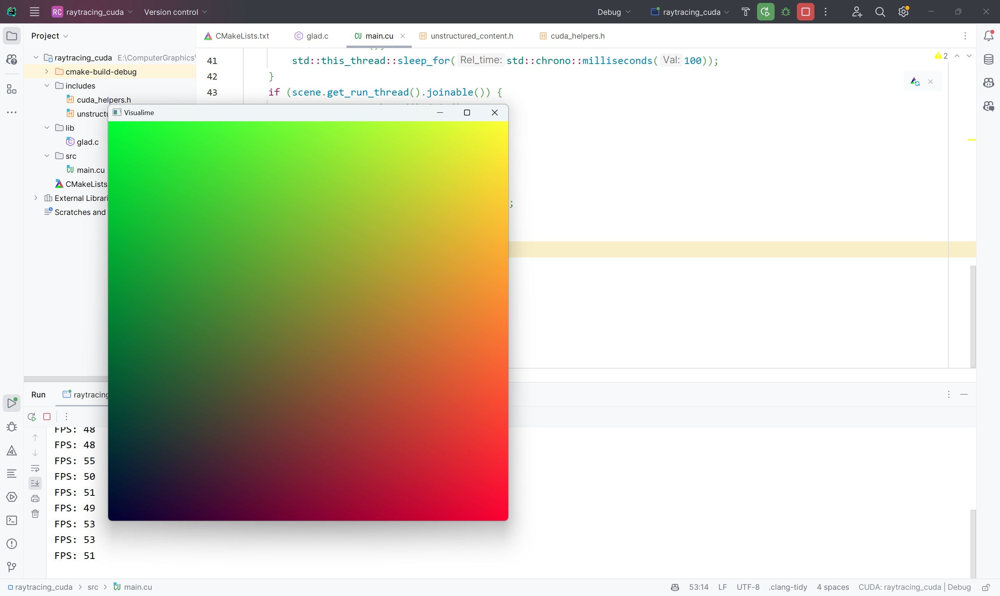

# Raytracing in CUDA C++
## Introduction
### Visualime
This project's visualization is not in the form of writing a "hard to see" `.ppm` file,
instead, it's based on my previous project in [visualime](https://github.com/alexzms/visualime),
which is a simple 2D visualization rendering engine, I borrow its capability of directly popping up an
opengl window given a CUDA&OpenGL Interoperability memory(which is `visualime::opengl_wrapper::cuda_opengl_wrapper`).
So, that's pretty neat, if you haven't checked out visualime, you should definitely check it out.
### Raytracing in C++
You can find my previous project on `raytracing in C++` in [this repository](https://github.com/alexzms/ray_tracing_cpp).
### Raytracing in CUDA C++
Work progress:
- [x] visualization based on [visualime](https://github.com/alexzms/visualime)
- [x] basic rendering complete (naive raytracing)
- [x] accumulative ray color

TODOs:
- [ ] speed up by Importance Sampling
- ...

## Nvidia Nsight Compute Analysis
Recently I just found out that Nvidia Nsight Compute is a perfect tool for analyzing CUDA code.
So in this project, I just simply use it to analyze the instruction level `fp32`/`fp64` arithmetic call.
Also, I tried out the System Trace functionality, though I currently didn't work it out very nicely.

## Demonstration

## References
- [Ray Tracing in One Weekend](https://raytracing.github.io/books/RayTracingInOneWeekend.html)
- [Ray Tracing: The Next Week](https://raytracing.github.io/books/RayTracingTheNextWeek.html)
- [Ray Tracing: The Rest Of Your Life](https://raytracing.github.io/books/RayTracingTheRestOfYourLife.html)
- [Nvidia Nsight Compute](https://developer.nvidia.com/nsight-compute)
- [Nvidia Nsight Systems](https://developer.nvidia.com/nsight-systems)
- [Nvidia Nsight Graphics](https://developer.nvidia.com/nsight-graphics)
- [Raytracing using CUDA](https://developer.nvidia.com/blog/accelerated-ray-tracing-cuda/)